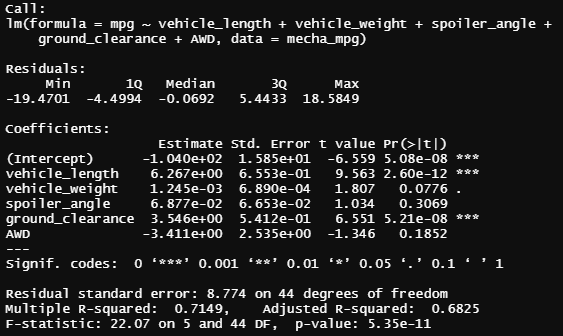
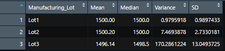
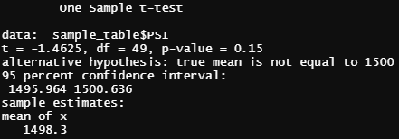
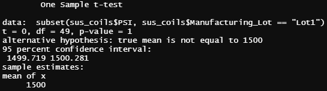
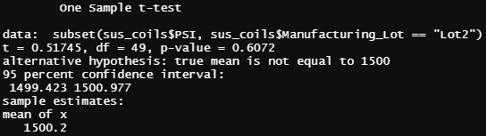
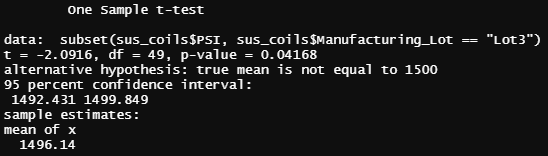

# MechaCar_Statistical_Analysis
---
## Linear Regression to Predict MPG

Using the linear model function in the dplyr library in R, the following summary was generated to determine the significance of various design specifications for the MechaCar's fuel efficiency (MPG).



- Vehicle length and ground clearance appear to provide the most significant affect upon fuel efficiency.
- As we have rejected the null hypothesis (that there is no correlation between the given coefficients and fuel efficiency), the slope of the linear model is not equal to 0.
- The linear model may possibly have some predictive ability for fuel efficiency, but with the intercept being so significant, variables that are not in the dataset are affecting MPG for the MechaCar.

---
## Summary Statistics on Suspension Coils

Summary statistics were generated for the dataset concerning PSI for suspension coils. A total summary was created, as well as a grouped summary of the 3 different manufacturing lots.

Total Summary


Grouped Summary (by lot)



- As a total group, the coils meet design specifications. But when broken down by lot, Lot 3 fails to fall within 100 PSI variance range given by the design specification.

---
## T-Tests on Suspension Coils

A series of t-tests was run on the suspension coil PSI dataset, one for a sample from the total against the population mean, and another three with each individual manufacturing lot compared against the total mean.

```
***NOTE TO GRADER*** 
Using the actual calculated population mean (1498.78) yields the exact opposite set of results from using the stated mean of 1500. As the module instructions said to use 1500, that is what has been done.
```

Total vs Sample T-Test



- As the p-value is higher than 0.05 (p-value = 0.15), the null hypothesis of no difference between sample and population mean was ***accepted***.

Lot 1 T-Test

 

- As the p-value is higher than 0.05 (p-value = 1) for the lot 1 test, the null hypothesis of no diffence in sample versus mean has been ***accepted***.

Lot 2 T-Test



- As the p-value is higher than 0.05 (p-value = 0.61) for the lot 2 test, the null hypothesis of no diffence in sample versus mean has been ***accepted***.

Lot 3 T-Test



- As the p-value is lower than 0.05 (p-value = 0.04) for the lot 3 test, the null hypothesis of no diffence in sample versus mean has been ***rejected***.
  
---
## Study Design: MechaCar vs Competition

The study would help determine the long term cost of owning a MechaCar versus other vehicles of the same class on the market.

- Metric used:
  - mean maintenance cost (as calculated from data provided by automobile industry testers or even the manufacturers themselves)

A one-sample t-test would be used. Using data from independent automobile testers, the mean maintenance cost would be calculated for all cars in the same class as the MechaCar.

H<sub>0</sub> : There is no difference in the maintenance cost of the MechaCar in relation to the mean maintenance cost for all cars in the same class.

H<sub>a</sub> : There is a significant difference in the maintenance cost of the MechaCar in relation to the mean maintenance cost for all cars in the same class.